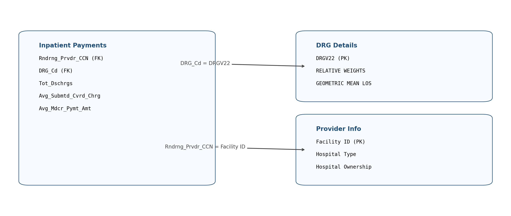

# US Medicare Inpatient Payments — SQL‑focused analytics case study

This repo is a locally runnable case study built around **CMS Medicare inpatient hospital payments**.

Hospitals publish (and bill) “submitted charges”, but Medicare reimburses only part of that. The gap is where the story starts:

> Where are charges systematically high relative to Medicare payments, and how do complexity, geography, and ownership relate to that?

The project is intentionally **SQL‑first**:
- **PostgreSQL** holds the analytical logic (CTEs, GROUP BY, window functions)
- **Python** is only used where it’s the practical tool (cleaning/export, loading tables, and plotting directly in notebooks)

This version runs on **PostgreSQL** locally (default port **5432**).

---

## Project structure

```
project-root/
├── data/
│   └── cleaned/
├── notebooks/
│   ├── 1_understanding.ipynb
│   ├── 2_cleaning.ipynb
│   ├── 3_database_setup.ipynb
│   ├── 4_python_analysis.ipynb
│   ├── 5_sql_analysis.ipynb
│   └── 6_advanced_case_study.ipynb
├── sql/
│   ├── create_tables.sql
│   ├── joins.sql
├── visuals/
├── .gitignore
└── requirements.txt
```

---

## Data model (how the tables join)



### What the diagram means (plain English)

- **Inpatient Payments** is the core table at **hospital × DRG** grain.
- **Provider Info** adds hospital attributes (ownership, type).
- **DRG Details** adds complexity context (relative weight, LOS proxy).

Join keys:
- `Inpatient.Rndrng_Prvdr_CCN` = `Provider.Facility_ID`
- `Inpatient.DRG_Cd` = `DRG.DRGV22`

In PostgreSQL, Notebook 3 creates a view called `vw_inpatient_analytics` so queries don’t have to repeat joins.

---

## How to run (local, VS Code)

### 1) Install dependencies

```bash
python -m pip install -r requirements.txt
```

### 2) Configure PostgreSQL credentials

Open `notebooks/3_database_setup.ipynb` and set your PostgreSQL connection parameters:

- `host`
- `port`
- `user`
- `password`
- `database`

Same values are also used in the SQL notebooks.

### 3) Run notebooks in order

1. `notebooks/1_understanding.ipynb` — load raw files + sanity check join keys
2. `notebooks/2_cleaning.ipynb` — create cleaned CSVs in `data/cleaned/`
3. `notebooks/3_database_setup.ipynb` — create tables, load CSVs, create `vw_inpatient_analytics`
4. `notebooks/4_python_analysis.ipynb` — distributions and relationship plots (shown in-notebook)
5. `notebooks/5_sql_analysis.ipynb` — main analysis (SQL + window functions) + charts shown in-notebook
6. `notebooks/6_advanced_case_study.ipynb` — case study answers and synthesis

---

## What’s “SQL-focused” here?

Examples of SQL features used in the analysis:
- `WITH` CTEs to keep queries readable
- `GROUP BY` aggregations (hospital / DRG / state)
- Window functions:
  - `ROW_NUMBER()`
  - `RANK()` / `DENSE_RANK()`
  - `SUM() OVER (...)` and `PERCENT_RANK()` for share and percentile-based insights

Charts are displayed directly in the notebooks (no file export step).

---

## Notes

- This project intentionally keeps analysis logic in SQL to keep it auditable.
- The `visuals/` folder holds the data model diagram used in the README.
